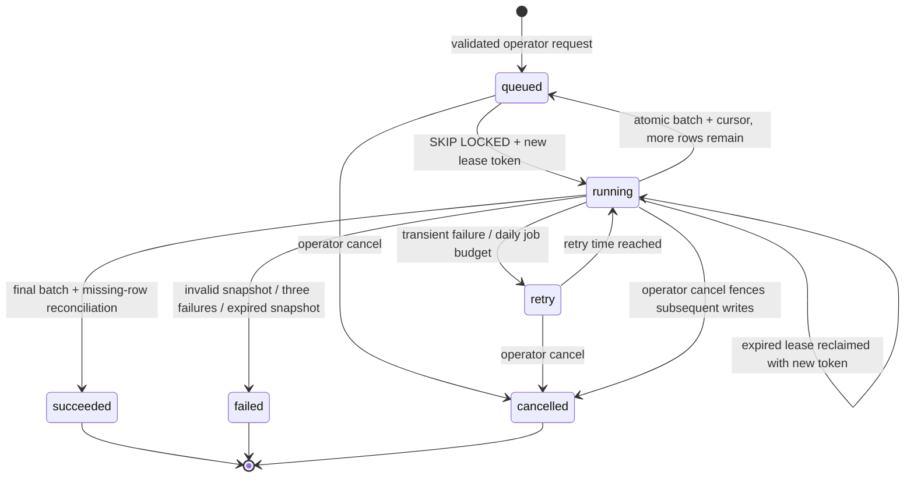

# Durable imports and operations — Rolecraft 1.1

This milestone replaces the need to keep a browser request alive for a full Greenhouse board refresh. The existing bounded direct importer remains available for small explicit operations; use the new queue for resumable board imports. There is no automatic recurring crawl and no worker started inside the web application.

## Start and operate

1. Provision PostgreSQL with pgvector. Use a migration-capable identity to run `python scripts/manage.py migrate`; it applies `001_init.sql` and additive `002_imports.sql` in order. Reapplying them does not truncate existing data. Use a least-privileged runtime database identity afterward.
2. Configure `DATABASE_URL`, `OPENAI_API_KEY`, a random 32+ character `APP_ACCESS_TOKEN`, and a **different** random 32+ character `INGEST_TOKEN` in the appropriate secret manager. Neither token belongs in a URL, command-line argument, repository, screenshot, or chat.
3. Run the web application and a separate worker: `python -m rolecraft.worker`. With the container configuration, `docker compose -f compose.app.yml --profile live up --build` runs both. The database URL must be reachable **from the containers**; container-local `localhost` is not your host database. Do not use the disposable CI database for production.
4. Open `/operations`, enter the ingestion token, and queue an authorized board token. The API returns `202` with a run identifier, or `200` for the same already-active board. Refresh progress manually or enable 15-second auto-refresh. Polling stops while the page is hidden.
5. The history is read from PostgreSQL, survives browser refreshes and process restarts, and exposes no snapshot payloads or fencing tokens. Cancel an active run to stop its future writes. Completed batches stay indexed. A new import after failure or cancellation is a new, budgeted run with a fresh snapshot.

### Container-only demo

`docker compose -f compose.app.yml up --build` runs just the non-root web image, with a read-only filesystem, writable temporary directory and dropped capabilities. Leave `DATABASE_URL` unset to use the 24 fictional jobs. The `live` profile is opt-in. Development ports bind to the loopback interface. Production requires a TLS reverse proxy or a hosting platform with HTTPS; the sample compose file is not an Internet-facing deployment recipe.

## Import state machine

The worker records a heartbeat, claims a single bounded work unit, then releases its database transaction before external network calls. A ten-minute lease and a random fencing token identify the current owner. The source advisory lock and a locked run-row check protect the commit. An expired or cancelled owner cannot advance the cursor or overwrite data after ownership changes. Independent boards can be processed by separate worker processes using PostgreSQL `FOR UPDATE SKIP LOCKED`.

The first work unit fetches **one** Greenhouse response, validates all records, and persists the normalized snapshot. Remaining units and retries resume this snapshot, not a freshly downloaded list with shifting offsets. A snapshot older than 24 hours is rejected, leaving existing data intact; queue a fresh run. Oversized, empty or malformed snapshots fail conservatively rather than deleting existing jobs. The first release intentionally requires operator review of genuinely empty boards.

Every unit indexes at most five jobs. Provider calls complete before the job transaction. The final database transaction contains the job/chunk updates **and** the cursor checkpoint. Rollback therefore cannot leave a cursor ahead of its records. Only the final successful batch closes missing IDs from the same source. Partial success remains visible; a whole board is not staged invisibly until completion. Cancellation does not undo committed batches.

Legacy synchronous writes take the same source lock and are rejected while a queued import owns that source. There is one active run per canonical board token. Public API responses include run state, progress and sanitized error codes, never stored snapshots or lease tokens.

## Limits, retries and costs

| Control | Bound / behavior |
|---|---|
| Greenhouse response | 12 MB; 200 normalized jobs per snapshot; no silent truncation |
| Batch | 5 jobs; existing description/chunk/embedding call limits still apply |
| Admission | 10 new runs per UTC day, at most 20 active runs; duplicate active boards do not consume another admission |
| Indexing | `DAILY_IMPORT_JOB_LIMIT=200` job-attempts/day, configurable 5–2,000 |
| Lease | 600 seconds; ownership rechecked inside the write transaction |
| Transient failures | Three total failures per run; 30/60-second waits before further attempts; exhausted runs stop |
| Crashed workers | Expired leases can be reclaimed; crashes consume the same failure budget |
| Daily budget reached | Preserve snapshot/cursor; defer until the next UTC day; does not count as an upstream failure |
| Snapshot age | 24 hours; expired snapshots fail without reconciliation |
| History | API returns newest 40 runs; prune terminal history explicitly |

Quotas count **attempted jobs**, not dollars or tokens. A failure or crash after an embedding request can cause the request to be repeated and billed again; this is at-least-once processing, not exactly-once paid-provider execution. Use provider-side spending limits as an additional control. A queued import uses its own admission/job budgets; old direct imports retain their existing per-request budget. Disabling the direct endpoint at your gateway is appropriate when only queued imports should be permitted operationally.

`python -m rolecraft.worker --once` processes at most one work unit (not a whole board). `python -m rolecraft.worker --prune 7` deletes only terminal run metadata older than seven days. It does not delete source jobs or vectors. Schedule pruning explicitly in your own approved infrastructure. The main worker respects SIGINT/SIGTERM after its bounded current unit.

## Readiness versus liveness

`GET /api/health` is process liveness. `GET /api/readiness` requires the workspace token in live mode and returns `503` until configuration, schema and a fresh indexed corpus pass. It performs actual PostgreSQL reads but never paid provider requests. `GET /api/operations` requires the **ingestion token** in live mode and includes sanitized run history and worker heartbeat age.

A recent heartbeat is evidence that a worker checked in, not proof of successful external ingestion. Credential presence is configuration, not provider availability. A `200` readiness response does not prove the source is accurate, the model account has credit, or a production deployment is correctly wired. Verify one authorized real source and a filtered semantic search after provisioning credentials.

## Release and recovery gates

CI tests real PostgreSQL concurrency, lease recovery, cancellation fencing, snapshot persistence, job budgets, retries, safe errors, source ownership, atomic rollback, and full-snapshot closure. Paid provider boundaries are mocked. It also verifies the actual HTTP application in Chromium, Firefox and WebKit and builds/runs the non-root container. Screenshot capture refuses live/private targets and asserts loaded images, populated controls, zero page errors and no horizontal overflow.

Back up PostgreSQL before deployment. Apply additive migrations before starting the new worker. Deploy web and worker with matching source versions. Rolling back the web release does not undo migrations or imported records. Stop workers before rolling back to an older application that does not understand queue ownership. Keep a previous image tag and a database restore procedure.

### Platform references

- [PostgreSQL 16 SELECT locking and SKIP LOCKED](https://www.postgresql.org/docs/16/sql-select.html#SQL-FOR-UPDATE-SHARE)
- [Greenhouse public Job Board API](https://docs.greenhouse.io/job-board.html)
- [FastAPI on Vercel](https://vercel.com/docs/frameworks/backend/fastapi)
- [Vercel Function limits](https://vercel.com/docs/functions/limitations)
